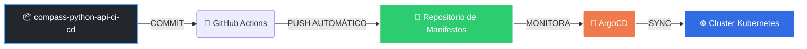

<div align="center">


<div align="center">

# 🛠️ Kubernetes Manifestos: CI/CD Pipeline (GitOps Source)

[](https://www.gitops.tech/)
[](https://kubernetes.io/)
[](https://argo-cd.readthedocs.io/)

**Fonte de verdade (Single Source of Truth) para o deploy contínuo da aplicação `compass-python-api-ci-cd`**

[📋 Sobre](#-sobre-o-projeto) • [🏗️ Estrutura](#-estrutura) • [🚀 GitOps](#-fluxo-gitops) • [⚙️ Componentes](#-componentes-de-infraestrutura)

---

</div>

## 📋 Sobre o Projeto

<div align="center">

```ascii
╔════════════════════════════════════════════════════════════════╗
║                                                                ║
║     Este repositório contém a Infraestrutura como Código      ║
║              para a aplicação compass-python-api-ci-cd         ║
║                                                                ║
╚════════════════════════════════════════════════════════════════╝
```

</div>

Este repositório serve como o **repositório de Manifestos** que é monitorado continuamente pelo **ArgoCD**. O ArgoCD é o motor de entrega contínua (CD) que lê esses arquivos e garante que o estado do cluster Kubernetes corresponda exatamente ao que está definido aqui.

---

## 🎯 Objetivo Principal

<table>
<tr>
<td width="50%" valign="top">

### 🔄 Atualização Automática

A tag da imagem Docker é **atualizada automaticamente** pelo pipeline CI/CD (GitHub Actions) do repositório da aplicação.

```yaml
image: compass-python-api:abc123
        ↓
image: compass-python-api:xyz789
```

</td>
<td width="50%" valign="top">

### 🚀 Deploy Contínuo

O ArgoCD lê o `deployment.yaml` e **implanta automaticamente** a nova versão da aplicação (GitOps).

```
Git Commit → ArgoCD Sync → K8s Deploy
```

</td>
</tr>
</table>

> 💡 **Este repositório é o único ponto de mudança para o ambiente Kubernetes**

---

## 🏗️ Fluxo GitOps

<div align="center">

### 🔗 Ponto de Encontro entre CI e CD

</div>



<div align="center">

| Etapa | Ferramenta | Ação |
|:-----:|:----------:|:-----|
| **1** | 🤖 **GitHub Actions** | Faz o Build e sobrescreve o `deployment.yaml` com a nova tag |
| **2** | 🚢 **ArgoCD** | Monitora a branch `main` e detecta mudanças |
| **3** | ☸️ **Kubernetes** | Sincroniza e aplica os manifestos no cluster |

</div>

---

## 📁 Estrutura

<div align="center">

```
kubernetes-manifestos/
├── 📄 deployment.yaml      # Configuração dos Pods e Réplicas
└── 📄 service.yaml         # Exposição da aplicação
```

</div>

### 📑 Detalhamento dos Arquivos

<table>
<thead>
<tr>
<th width="25%">Arquivo</th>
<th width="40%">Descrição</th>
<th width="35%">Responsabilidade</th>
</tr>
</thead>
<tbody>
<tr>
<td align="center">
<code>deployment.yaml</code>
<br><br>
🎯
</td>
<td>
Define o <strong>Deployment</strong> do Kubernetes:
<ul>
<li>Pods</li>
<li>Réplicas</li>
<li>Tag da imagem Docker</li>
</ul>
</td>
<td align="center">
<br>
✅ <strong>Atualizado Automaticamente</strong><br>pelo GitHub Actions
</td>
</tr>
<tr>
<td align="center">
<code>service.yaml</code>
<br><br>
🌐
</td>
<td>
Define o <strong>Service</strong> do Kubernetes:
<ul>
<li>Exposição interna</li>
<li>ClusterIP</li>
<li>Portas de acesso</li>
</ul>
</td>
<td align="center">
<br>
🔧 <strong>Configurado Manualmente</strong>
</td>
</tr>
</tbody>
</table>

---

## 🚀 Componentes de Infraestrutura

Estes arquivos definem os seguintes recursos no cluster Kubernetes (Rancher Desktop):

<div align="center">

### ⚙️ Recursos Kubernetes

</div>

<table>
<tr>
<td width="50%" align="center">

### 🎯 Deployment
**`hello-app-deployment`**

<br>

```yaml
apiVersion: apps/v1
kind: Deployment
```

<br>

Garante que o número desejado de instâncias (`replicas`) da aplicação esteja sempre rodando.

<br>

**Características:**
- ✅ Auto-scaling
- ✅ Rolling updates
- ✅ Health checks

</td>
<td width="50%" align="center">

### 🌐 Service
**`hello-app-service`**

<br>

```yaml
apiVersion: v1
kind: Service
```

<br>

Cria um ponto de acesso interno (`ClusterIP`) para que a aplicação possa ser alcançada.

<br>

**Características:**
- ✅ Load balancing
- ✅ Service discovery
- ✅ Port mapping

</td>
</tr>
</table>

---

## 🔗 Referência Cruzada

<div align="center">

### 📦 Ecossistema de Repositórios

</div>

<table>
<thead>
<tr>
<th width="40%">Repositório</th>
<th width="60%">Propósito</th>
</tr>
</thead>
<tbody>
<tr>
<td align="center">
<br>
<strong>compass-python-api-ci-cd</strong>
<br><br>
📦 <em>Aplicação</em>
<br><br>
</td>
<td>
<br>
Contém o <strong>código-fonte</strong> e o <strong>pipeline de CI</strong> que atualiza este repositório.
<br><br>
<code>main.py</code> → <code>Dockerfile</code> → <code>.github/workflows/</code>
<br><br>
</td>
</tr>
<tr>
<td align="center">
<br>
<strong>Este Repositório</strong>
<br><br>
🎯 <em>Manifestos</em>
<br><br>
</td>
<td>
<br>
Contém a <strong>configuração (Manifestos)</strong> que é lida pelo ArgoCD para o deploy.
<br><br>
<code>deployment.yaml</code> + <code>service.yaml</code> = <strong>Single Source of Truth</strong>
<br><br>
</td>
</tr>
</tbody>
</table>

---

<div align="center">

## 👨‍💻 Autor


### **Thiago Cardoso Davi**

[](mailto:analyticsdev.thiago@gmail.com)
[](https://www.linkedin.com/in/analyticsthiagocardoso)
[](https://github.com/Thiago-code-lab)

<br>

> 🧭 Desenvolvido como parte do **Programa de Bolsas DevSecOps - Compass UOL**

</div>

---

<div align="center">

## ⭐ Agradecimentos

**Compass UOL** pelo programa de bolsas e oportunidade de aprendizado  
Comunidade **Cloud Native** pelas ferramentas open-source incríveis

</div>

---

<div align="center">

### **Se este projeto foi útil para você, considere dar uma ⭐!**

<br>

Feito com ❤️ e ☕ por [**Thiago Cardoso Davi**](https://github.com/Thiago-code-lab)

<br>

</div>

```ascii
╔═══════════════════════════════════════╗
║  Kubernetes + ArgoCD = Mágica do DevOps  ║
╚═══════════════════════════════════════╝
```

</div>
